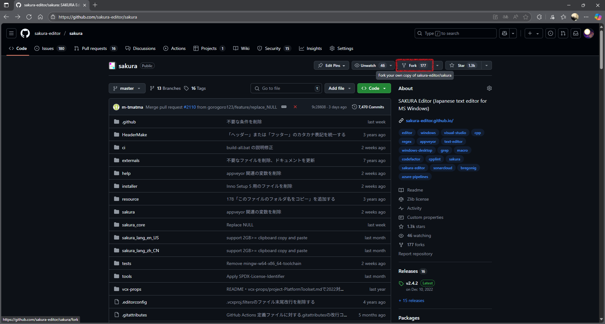
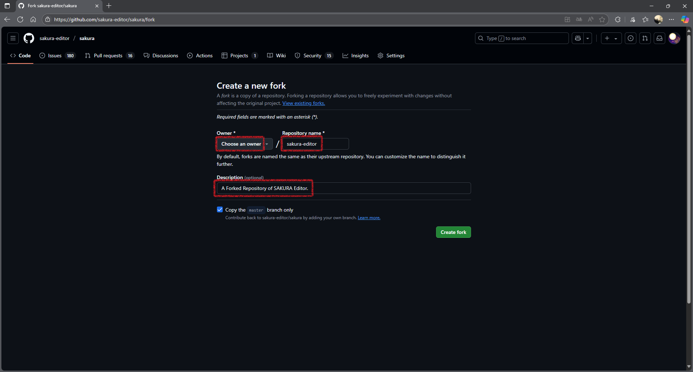
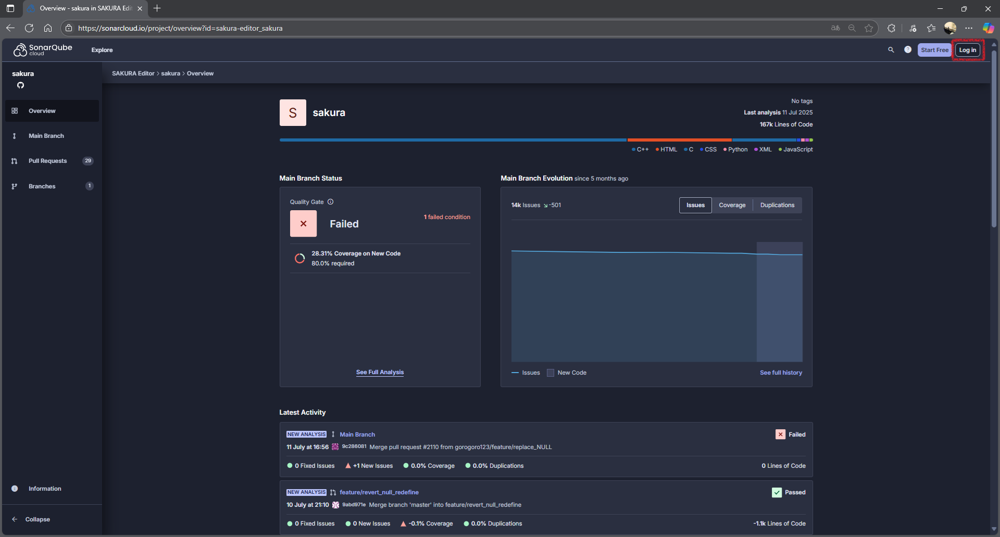
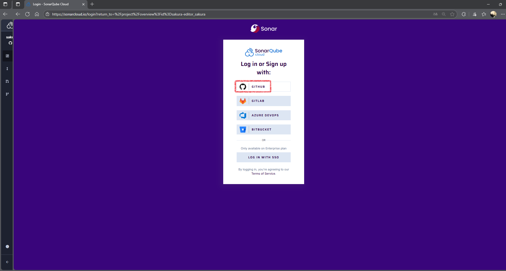
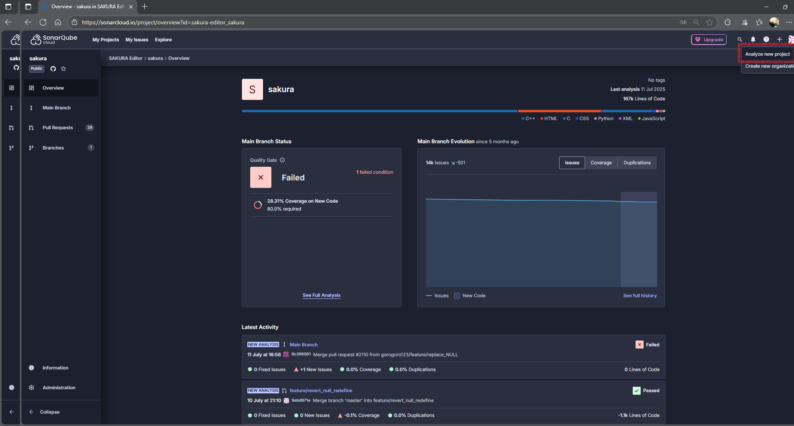
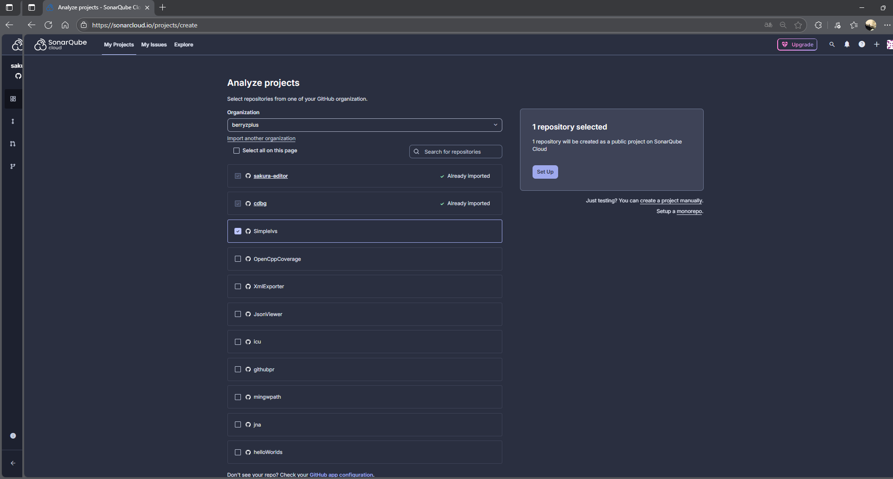
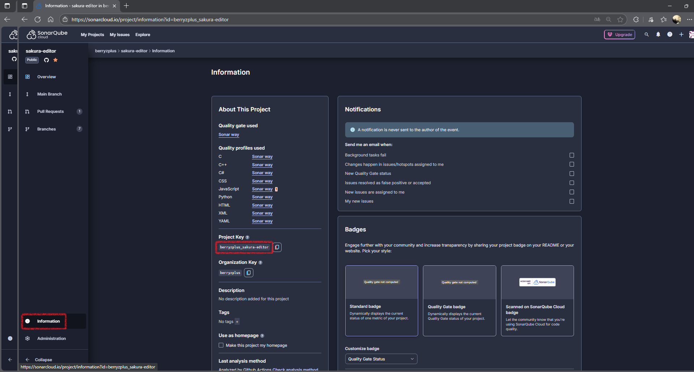
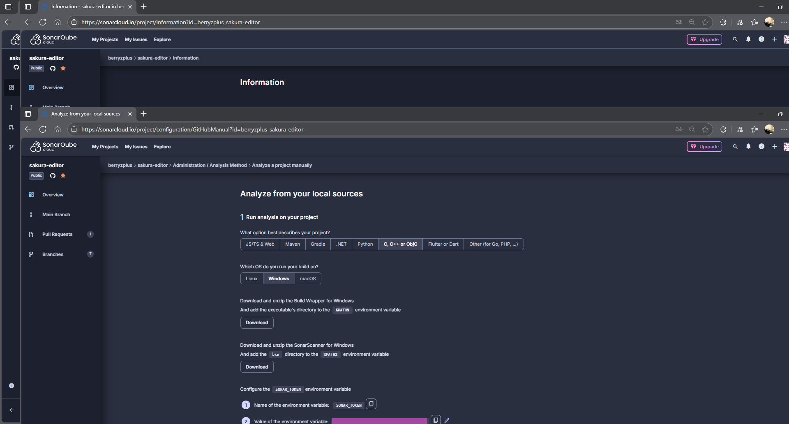

= SonarQube

:toc:
:toc-title: 目次
:sectlinks:

== SonarQubeについて

=== SonarQubeとは？

https://www.sonarsource.com/products/sonarqube/[SonarQube] は https://www.sonarsource.com/[SonarSource] が提供する静的解析サービスです。

[cols="1,1,1,3"]
|===
|名称 |C/C++ |無料 |説明

|SonarQube Server Developper
|○
|×
|セルフホストのサーバーを構築できるパッケージ。`C/C++`の解析に標準で対応。サーバーをアクティベートするのにお金がかかる。

|SonarQube Cloud
|○
|△
|パブリッククラウド上のサーバーを利用できるサービス。`C/C++`の解析に標準で対応。構築済みサーバーを利用するのでアクティベートする必要がない。課金すればGitHubのプライベートリポジトリも解析できる。

|SonarQube Server Community
|△
|○
|セルフホストのサーバーを構築できるパッケージ。`C/C++`の解析に標準では非対応。別途 https://github.com/SonarOpenCommunity/sonar-cxx[サードパーティーのプラグイン] を導入すれば可能。サーバーをアクティベートするのにお金がかからない。
|===

`SonarQube Server Community Edition`と有償の上位プランについては割愛します。

=== SonarQube Cloud

https://sonarcloud.io/project/overview?id=sakura-editor_sakura[SonarQube Cloud] は https://www.sonarsource.com/products/sonarqube/[SonarQube] のクラウド版です。
`SonarQube Server`の`Developper相当の機能`を利用できます。

== SonarQube Cloudの使用方法

=== GitHub プロジェクトのフォーク

GitHub の https://github.com/sakura-editor/sakura/[プロジェクトページ] にアクセスし Fork します。

フォーク設定の必須項目を入力して続行します。

*SonarQube Cloud を利用するためにプロジェクトのForkは必須です。*

プロジェクト名`sakura-editor`にリネームしてください。
`sakura`のままだと`SonarQube Cloud`でプロジェクト作成したときに視認しづらいためです。

フォークしたリポジトリはSSH接続でクローンしてください。

[source,gitbash]
----
git clone git@github.com:<your-name>/sakura-editor.git

git remote add project https://github.com/sakura-editor/sakura
----

=== SonarQube Cloud のアカウント設定

https://sonarcloud.io/project/overview?id=sakura-editor_sakura[SonarQube Cloud] にアクセスします。

`GitHubアカウント`を選択して連携ログインします。

初回の連携ログイン時には「`GitHubアカウント`に設定した個人情報を`SonarQube Cloud`に連携してよいか？」的なことを聞かれます。連携しないとGitHubリポジトリを取り込めないので、許可してあげてください。

どうしても信用できないなら`SonarQube Cloud`の利用は諦めてください。

=== SonarQube Cloud プロジェクトの作成

https://sonarcloud.io/project/overview?id=sakura-editor_sakura[SonarQube Cloud] のプロジェクトを追加します。

`GitHubアカウント` → `GitHubプロジェクト` の順で選択しプロジェクトを作成します。

SonarQube Cloudプロジェクトを作成したら`projectKey`を確認します。

`projectKey`は `GitHubアカウント名` と `GitHubリポジトリ名` を `_` で繋げたものです。独自に変更すると`.\tools\SonarQube\Run-SonnarScanner.ps1`が動かないので注意してください。`

`projectKey`は`Administration > Update Key`でいつでも更新できます。

SonarQube Cloudプロジェクトを作成したら`SONAR_TOKEN`を確認します。

*`SONAR_TOKEN`はパスワードなので漏れないように注意します。*

取得した`SONAR_TOKEN`はworking treeのルートに`SONAR_TOKEN`という名前で保存します。

[source,powershell]
----
echo "xxxxxxxxxxxxxxxxxxxxxxxxxxxxxx" > SONAR_TOKEN
----

`SONAR_TOKEN`は https://sonarcloud.io/account/security[My Account > Security] でいつでも生成(Generate Token)・破棄(Revoke)できます。

ヘルプ: https://docs.sonarsource.com/sonarqube-cloud/managing-your-account/managing-tokens/[Managing your tokens]

=== SonarQube Cloud のプロジェクト解析手順

https://sonarcloud.io/about[SonarQube Cloud] のプロジェクト解析手順は次の通りです。

. 解析のためにプロジェクトをビルドする。
. 解析のためにテストを実行する。
. `SonarScanner`でプロジェクトを解析する。

1から3の間にプロジェクトのファイルを編集すると解析は失敗します。
`C/C++`プロジェクトでは、1の実行に https://docs.sonarsource.com/sonarqube-server/latest/analyzing-source-code/languages/c-family/prerequisites/#using-buildwrapper[Build Wrapper] が必要です。

サクラエディタでは、上記手順を自動実行するpowershellスクリプトを用意しています。

[source,powershell]
----
choco install 7zip -y
choco install OpenCppCoverage -y

.\tools\SonarQube\Analyze-Project.ps1 x64 Debug
----

7zipはビルドに使用されます。

OpenCppCoverageはコードカバレッジを取得するために使用されます。

SonarScannerに必要なJavaランタイムは、動的にダウンロードされます。

インストール済みのJDKがある場合は、`$env:JAVA_HOME`を設定してください。
OpenJDK 17以降が必要です。
`$env:JAVA_HOME`の設定には https://learn.microsoft.com/ja-jp/powershell/module/microsoft.powershell.core/about/about_profiles?view=powershell-7.5#the-profile-variable[$PROFILE] を使うと便利です。

=== Analyze-Project.ps1 の詳細

Analyze-Project.ps1 シーケンス図

[mermaid]
----
sequenceDiagram
    participant User as ユーザー
    participant AP as Analyze-Project.ps1
    participant BW as Build-Project.ps1
    participant RT as Run-Tests.ps1
    participant RS as Run-SonarScanner.ps1

    User->>AP: ./tools/SonarQube/Analyze-Project.ps1 x64 Debug
    
    AP->>BW: Build-Project.ps1実行
    BW->>BW: build-wrapper + msbuildでリビルド実行
    BW-->>AP: 完了

    AP->>RT: Run-Tests.ps1実行
    alt Visual Studio Code Coverage利用可能
        RT->>RT: vstest.console.exe実行
    else その他
        RT->>RT: OpenCppCoverage実行
    end
    RT-->>AP: 完了

    AP->>RS: Run-SonarScanner.ps1実行
    RS->>RS: SonarScanner実行
    RS-->>AP: 完了

    AP-->>User: 解析完了
----

== SonarQube に関する情報

=== SonarQube の使用方法に関するサイト

* https://www.appveyor.com/blog/2016/12/23/sonarqube/[Appveyor - SonarQube Analysis]

=== SonarScannerCLI のマニュアル

* https://docs.sonarsource.com/sonarqube-server/latest/analyzing-source-code/scanners/sonarscanner/[SonarScannerCLI]
* https://docs.sonarsource.com/sonarqube-server/latest/analyzing-source-code/analysis-parameters/[Analysis parameters]
* https://docs.sonarsource.com/sonarqube-server/latest/analyzing-source-code/languages/c-family/overview/[C/C++/Objective-C analysis overview]
* https://github.com/SonarSource/sonar-scanner-cli[GitHub - SonarScannerCLI]

=== 関連資料

* https://github.com/SonarSource/sonarlint-visualstudio[SonarQube for IDE: Visual Studio 2022 (formerly SonarLint)] インストール推奨。
* https://github.com/SonarSource/sonarlint-vscode[SonarQube for IDE: Visual Studio Code (formerly SonarLint)]
