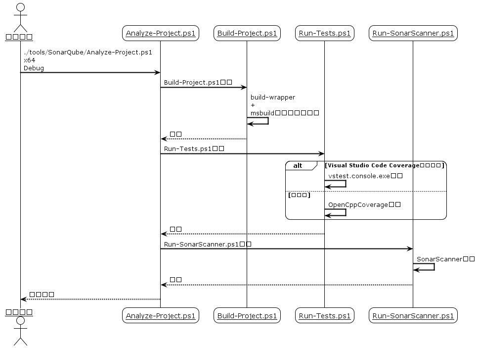

# SonarQube

## 目次

- [SonarQube](#sonarqube)
  - [目次](#目次)
  - [SonarQubeについて](#sonarqubeについて)
    - [SonarQubeとは？](#sonarqubeとは)
    - [SonarQube Cloud](#sonarqube-cloud)
  - [SonarQube Cloudの使用方法](#sonarqube-cloudの使用方法)
    - [GitHub プロジェクトのフォーク](#github-プロジェクトのフォーク)
    - [SonarQube Cloud のアカウント設定](#sonarqube-cloud-のアカウント設定)
    - [SonarQube Cloud プロジェクトの作成](#sonarqube-cloud-プロジェクトの作成)
    - [SonarQube Cloud のプロジェクト解析手順](#sonarqube-cloud-のプロジェクト解析手順)
    - [Analyze-Project.ps1 の詳細](#analyze-projectps1-の詳細)
  - [SonarQube に関する情報](#sonarqube-に関する情報)
    - [SonarQube の使用方法に関するサイト](#sonarqube-の使用方法に関するサイト)
    - [SonarScannerCLI のマニュアル](#sonarscannercli-のマニュアル)
    - [関連資料](#関連資料)

## SonarQubeについて

### SonarQubeとは？

[SonarQube](https://www.sonarsource.com/products/sonarqube/) は [SonarSource](https://www.sonarsource.com/) が提供する静的解析サービスです。

| 名称 | C/C++ | 無料 | 説明 |
|------|-------|------|------|
| SonarQube Server Developper | ○ | × | セルフホストのサーバーを構築できるパッケージ。`C/C++`の解析に標準で対応。サーバーをアクティベートするのにお金がかかる。 |
| SonarQube Cloud | ○ | △ | パブリッククラウド上のサーバーを利用できるサービス。`C/C++`の解析に標準で対応。構築済みサーバーを利用するのでアクティベートする必要がない。課金すればGitHubのプライベートリポジトリも解析できる。 |
| SonarQube Server Community | △ | ○ | セルフホストのサーバーを構築できるパッケージ。`C/C++`の解析に標準では非対応。別途 [サードパーティーのプラグイン](https://github.com/SonarOpenCommunity/sonar-cxx) を導入すれば可能。サーバーをアクティベートするのにお金がかからない。 |

`SonarQube Server Community Edition`と有償の上位プランについては割愛します。

### SonarQube Cloud

[SonarQube Cloud](https://sonarcloud.io/project/overview?id=sakura-editor_sakura) は [SonarQube](https://www.sonarsource.com/products/sonarqube/) のクラウド版です。
`SonarQube Server`の`Developper相当の機能`を利用できます。

## SonarQube Cloudの使用方法

### GitHub プロジェクトのフォーク

GitHub の [プロジェクトページ](https://github.com/sakura-editor/sakura/) にアクセスし Fork します。


フォーク設定の必須項目を入力して続行します。


**SonarQube Cloud を利用するためにプロジェクトのForkは必須です。**

プロジェクト名`sakura-editor`にリネームしてください。
`sakura`のままだと`SonarQube Cloud`でプロジェクト作成したときに視認しづらいためです。

フォークしたリポジトリはSSH接続でクローンしてください。

```bash
git clone git@github.com:<your-name>/sakura-editor.git

git remote add project https://github.com/sakura-editor/sakura
```

### SonarQube Cloud のアカウント設定

[SonarQube Cloud](https://sonarcloud.io/project/overview?id=sakura-editor_sakura) にアクセスします。


`GitHubアカウント`を選択して連携ログインします。


初回の連携ログイン時には「`GitHubアカウント`に設定した個人情報を`SonarQube Cloud`に連携してよいか？」的なことを聞かれます。連携しないとGitHubリポジトリを取り込めないので、許可してあげてください。

どうしても信用できないなら`SonarQube Cloud`の利用は諦めてください。

### SonarQube Cloud プロジェクトの作成

[SonarQube Cloud](https://sonarcloud.io/project/overview?id=sakura-editor_sakura) のプロジェクトを追加します。


`GitHubアカウント` → `GitHubプロジェクト` の順で選択しプロジェクトを作成します。


SonarQube Cloudプロジェクトを作成したら`projectKey`を確認します。


`projectKey`は `GitHubアカウント名` と `GitHubリポジトリ名` を `_` で繋げたものです。独自に変更すると`.\tools\SonarQube\Run-SonnarScanner.ps1`が動かないので注意してください。

`projectKey`は`Administration > Update Key`でいつでも更新できます。

SonarQube Cloudプロジェクトを作成したら`SONAR_TOKEN`を確認します。


**`SONAR_TOKEN`はパスワードなので漏れないように注意します。**

取得した`SONAR_TOKEN`はworking treeのルートに`SONAR_TOKEN`という名前で保存します。

```powershell
echo "xxxxxxxxxxxxxxxxxxxxxxxxxxxxxx" > SONAR_TOKEN
```

`SONAR_TOKEN`は [My Account > Security](https://sonarcloud.io/account/security) でいつでも生成(Generate Token)・破棄(Revoke)できます。

ヘルプ: [Managing your tokens](https://docs.sonarsource.com/sonarqube-cloud/managing-your-account/managing-tokens/)

### SonarQube Cloud のプロジェクト解析手順

[SonarQube Cloud](https://sonarcloud.io/about) のプロジェクト解析手順は次の通りです。

1. 解析のためにプロジェクトをビルドする。
2. 解析のためにテストを実行する。
3. `SonarScanner`でプロジェクトを解析する。

1から3の間にプロジェクトのファイルを編集すると解析は失敗します。
`C/C++`プロジェクトでは、1の実行に [Build Wrapper](https://docs.sonarsource.com/sonarqube-server/latest/analyzing-source-code/languages/c-family/prerequisites/#using-buildwrapper) が必要です。

サクラエディタでは、上記手順を自動実行するpowershellスクリプトを用意しています。

```powershell
choco install 7zip -y
choco install OpenCppCoverage -y

.\tools\SonarQube\Analyze-Project.ps1 x64 Debug
```

7zipはビルドに使用されます。

OpenCppCoverageはコードカバレッジを取得するために使用されます。

SonarScannerに必要なJavaランタイムは、動的にダウンロードされます。

インストール済みのJDKがある場合は、`$env:JAVA_HOME`を設定してください。
OpenJDK 17以降が必要です。
`$env:JAVA_HOME`の設定には [$PROFILE](https://learn.microsoft.com/ja-jp/powershell/module/microsoft.powershell.core/about/about_profiles?view=powershell-7.5#the-profile-variable) を使うと便利です。

### Analyze-Project.ps1 の詳細



## SonarQube に関する情報

### SonarQube の使用方法に関するサイト

* [Appveyor - SonarQube Analysis](https://www.appveyor.com/blog/2016/12/23/sonarqube/)

### SonarScannerCLI のマニュアル

* [SonarScannerCLI](https://docs.sonarsource.com/sonarqube-server/latest/analyzing-source-code/scanners/sonarscanner/)
* [Analysis parameters](https://docs.sonarsource.com/sonarqube-server/latest/analyzing-source-code/analysis-parameters/)
* [C/C++/Objective-C analysis overview](https://docs.sonarsource.com/sonarqube-server/latest/analyzing-source-code/languages/c-family/overview/)
* [GitHub - SonarScannerCLI](https://github.com/SonarSource/sonar-scanner-cli)

### 関連資料

* [SonarQube for IDE: Visual Studio 2022 (formerly SonarLint)](https://github.com/SonarSource/sonarlint-visualstudio) インストール推奨。
* [SonarQube for IDE: Visual Studio Code (formerly SonarLint)](https://github.com/SonarSource/sonarlint-vscode)
